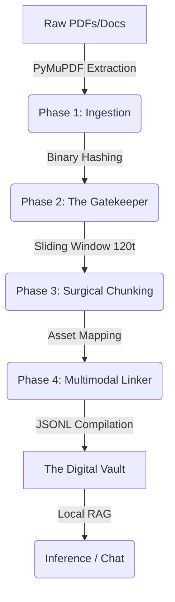

# GigaBookLM

GigaBookLM is a local-first, telemetry-free private alternative to propeitary third-part AI-based research assistants. The idea is to turn documents into researchable assets that contain as much as information as the original information does, but it's more lightweight and reusable.

## Motives (that's what get this running, right?)
- Zero Cloud: Local, Private, Nothing gets out, Just you, your resources and the LLM you're chatting with
- High Efficiency: Don't leave old, incapable hardware behind
- Asset Reusability: Use it anywhere, wherever, you want, be a free bird

## Phases

## How to use this

Well, quite frankly, this is still under a **WORK IN PROGRESS (WIP)**, so i'm still figuring how GigaBookLM can be used

## Contribution

I gotta be honest here, i definitely need some help, so if you wish, open an issue with the tag `Willing to Contribute` and your Discord handle, to Let me know you're interested to work on. And, i'll reach out to you directly to coordinate.
